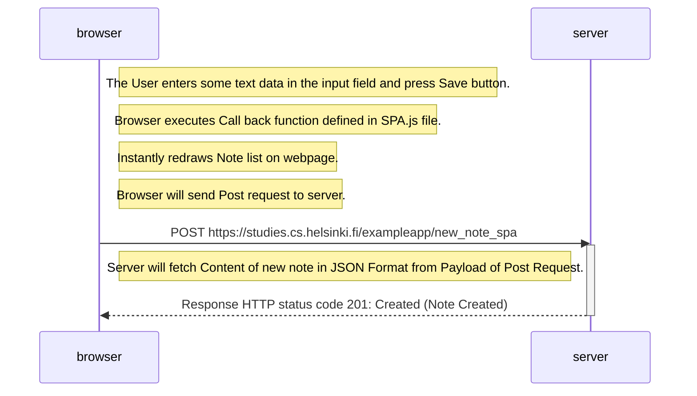

# Sequence Diagram for the user creates a new note in SPA

```mermaid

sequenceDiagram
    participant browser
    participant server

    Note right of browser: The User enters some text data in the input field and press Save button.
    Note right of browser:  Browser executes Call back function defined in SPA.js file.
    Note right of browser:  Instantly redraws Note list on webpage.
    Note right of browser:  Browser will send Post request to server.


    browser->>server: POST https://studies.cs.helsinki.fi/exampleapp/new_note_spa
    activate server
    
    Note left of server: Server will fetch Content of new note in JSON Format from Payload of Post Request.

    server-->>browser: Response HTTP status code 201: Created (Note Created)
    deactivate server

```